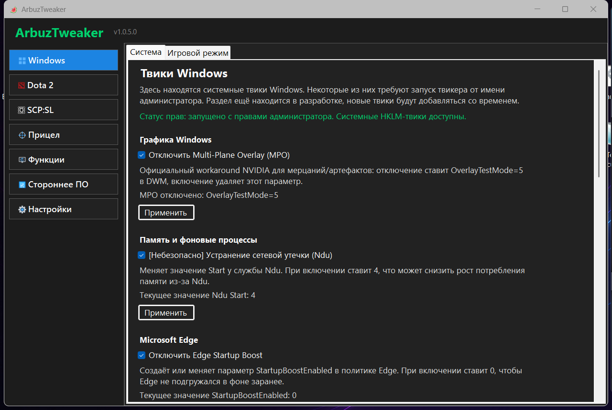
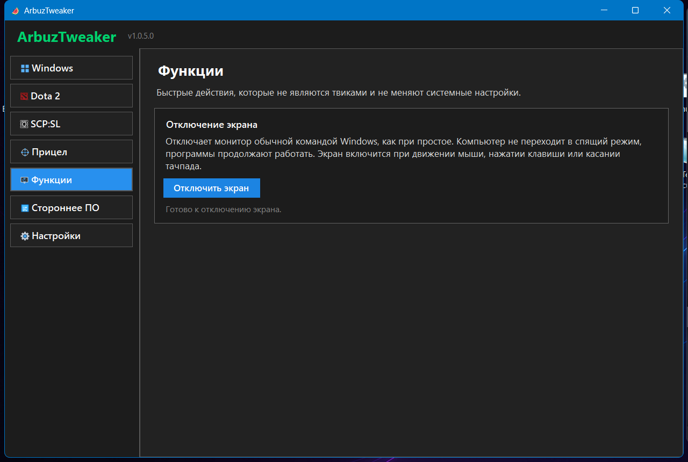
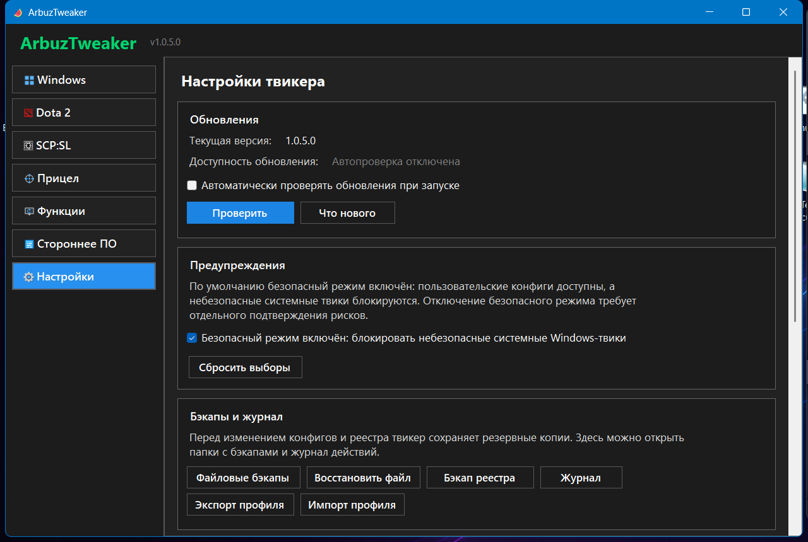

# ArbuzTweaker

ArbuzTweaker is an open-source Windows utility for configuring Windows tweaks, Dota 2, SCP: Secret Laboratory, a desktop crosshair overlay, and a few supporting tools from one interface.

The project focuses on understandable changes, backups before edits, and release distribution through GitHub Releases.

## Download

- Installer: `ArbuzTweaker-Setup.msi`
- Portable version: `ArbuzTweaker-Portable.zip`
- Latest release: https://github.com/Havermeng/ArbuzTweaker/releases/latest

New releases include `SHA256SUMS.txt` so the installer and portable archive can be checked against their published hashes.

## Screenshots

Windows tweaks:



Functions:



Settings and updates:



## What The App Changes

ArbuzTweaker can change:

- Windows registry values for selected Windows/game tweaks.
- Dota 2 `autoexec.cfg`, `video.txt`, and Steam `LaunchOptions` in `localconfig.vdf`.
- SCP:SL Steam `LaunchOptions` and `cmdbinding.txt`.
- Local ArbuzTweaker settings and crosshair presets.
- Scheduled tasks used for NVIDIA Overlay restart behavior.

The app does not inject DLLs, does not read or write game process memory, does not bypass bans, does not touch HWID, does not automate gameplay, and does not modify anti-cheat components.

## Safety And Rollback

- File changes are backed up before saving.
- Registry changes are backed up before applying Windows tweaks.
- Backups and logs are available from `Settings -> Backups and log`.
- Dota config restore is available through the file backup browser.
- Windows registry restore is available through registry backup restore.
- Safe mode is enabled by default and blocks unsafe Windows tweaks until the user explicitly accepts the risk.

## Admin Rights

Some Windows tweaks use `HKLM` registry keys or system commands and require administrator rights. The Windows tab shows whether the app is currently running with administrator rights.

User config edits for Dota 2 and SCP:SL generally do not require administrator rights.

## Is This A Cheat?

No. ArbuzTweaker edits user-accessible config files, Steam launch options, Windows settings, or local overlay settings. It is not cheat software and is not intended to provide unfair gameplay automation.

For any game, server, or tournament, the user is still responsible for following that game's rules.

## FAQ

### Can this cause a VAC ban?

The Dota 2 and SCP:SL sections are designed around config files and launch options, not process memory or injection. That said, no third-party tool can give a universal ban guarantee. If a game or server forbids a setting, do not use it.

### Why can antivirus or SmartScreen warn about it?

The app is young, distributed through GitHub Releases, and currently not signed with a paid code-signing certificate. That can trigger reputation warnings even when the file is clean. Check the source code, GitHub release, and SHA256 hash before running it.

### How do I uninstall it?

If installed with MSI, uninstall ArbuzTweaker through Windows Settings or Control Panel. Portable builds can be removed by deleting the extracted folder.

### How do I roll back changes?

Open `Settings -> Backups and log`. Use file backup restore for config files and registry backup restore for Windows registry changes.

### What is the difference between installer and portable?

The installer adds Start Menu/Desktop shortcuts and registers the app in Windows. The portable version runs from the extracted folder without installation.

## Build Locally

Requirements:

- Windows
- .NET 10 SDK
- WiX Toolset through the installer project dependencies

Build release artifacts:

```powershell
powershell -NoProfile -ExecutionPolicy Bypass -File .\scripts\build-release.ps1
```

The script produces:

- `artifacts/ArbuzTweaker-Setup.msi`
- `artifacts/ArbuzTweaker-Portable.zip`
- `artifacts/SHA256SUMS.txt`
